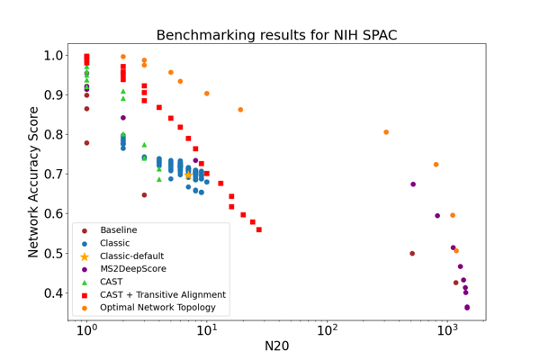

# MN_benchmakring
The GitHub repository for the paper: Network Topology Evaluation and Construction for Molecular Networking

## Project Structure 📂

Below is the hierarchical outline of the key directories and files within this project:

```plaintext
📦 project_directory
 ┣ 📂 data
 ┃ ┣ 📂 converted
 ┃ ┣ 📂 merged_pairs
 ┃ ┣ 📂 raw_ms2deepscore
 ┃ ┗ 📂 summary
 ┣ 📂 src
 ┃ ┣ 📂 Benchmarking
 ┃ ┣ 📂 Transirive_Alignment
 ┃ ┣ 📂 Plot
 ┃ ┗ 📜 utility.py
 ┗ 📂 results
   ┣ 📂 results-baseline
   ┣ 📂 results-cast
   ┣ 📂 results-MS2DeepScore
   ┣ 📂 results-re
   ┣ 📂 results-re-cast
   ┗ 📂 results-ClassyFire
📜 requirement.txt
📜 README.md
```

## Installation Guide 🛠️

Before running the project, ensure you have Python installed on your system. This project requires Python 3.8 or newer. You can download Python from [python.org](https://www.python.org/downloads/).

### Setting Up a Virtual Environment

It's recommended to use a virtual environment for Python projects. This keeps dependencies required by different projects separate by creating isolated environments for them. Here's how you can set it up:

1. Open a terminal or command prompt.
2. Navigate to the project's root directory.
3. Run the following command to create a virtual environment named `MN_benchmarking`:

```bash
python3 -m venv MN_benchmarking
source MN_benchmarking/bin/activate
pip install -r requirements.txt
```
## Benchmarking Guide 🚀

This section outlines the steps to benchmark the performance of different methods on the datasets specified in `input_library.txt`.

### Preparing the Datasets

First, list all the datasets you want to benchmark in a text file named `input_library.txt`. Place this file in the `PATH_TO_INPUT_LIBRARY_FOLDER` directory.

### Running Benchmarks

To benchmark the various methods, navigate to your project directory and execute the corresponding commands in the terminal.

#### Classic Method

```bash
python3 PATH_TO_PROJECT_FOLDER/scr/benchmarking/benchmark_classic.py --input PATH_TO_INPUT_LIBRARY_FOLDER/input_library.txt
```

#### CAST Method

```bash
python3 PATH_TO_PROJECT_FOLDER/scr/benchmarking/benchmark_cast.py --input PATH_TO_INPUT_LIBRARY_FOLDER/input_library.txt
```

#### CAST + Alignment Method

```bash
python3 PATH_TO_PROJECT_FOLDER/scr/benchmarking/benchmark_re_cast.py --input PATH_TO_INPUT_LIBRARY_FOLDER/input_library.txt
```

Make sure to replace `PATH_TO_PROJECT_FOLDER` and `PATH_TO_INPUT_LIBRARY_FOLDER` with the actual paths to your project and input library folder, respectively.

### Analyzing the Results

After running the benchmarks, analyze the output to compare the performance of the Classic, CAST, and CAST + Alignment methods. This comparison will help identify which method performs best for your specific datasets.

## Visualize the Benchmarking Results 📈

After successfully running the benchmarks, you'll find the results for each method stored in dedicated folders named `results-METHOD_NAME`. To proceed with visualizing these results and comparing the performance across different methods, follow these steps:

### Step 1: Prepare Your Results

Ensure that the results are correctly placed in their respective folders, such as `results-classic`, `results-cast`, and `results-re-cast`.

### Step 2: Adjust the Visualization Script

Navigate to the `benchmarking_plot.py` script located in `/src/plot/`. Adjust the dataset names within this script to align with those present in your benchmark results. This ensures that the script accurately retrieves and processes the data for visualization.

### Step 3: Generate the Plots

Run the `benchmarking_plot.py` script to visualize the results. Use the following command, adjusting the path as necessary:

```bash
python3 /path/to/MN_benchmarking/src/plot/benchmarking_plot.py
```

### Example Output

An example output figure will be saved to `results/plot/demo.png`, showcasing the comparative performance of the benchmarked methods. 

